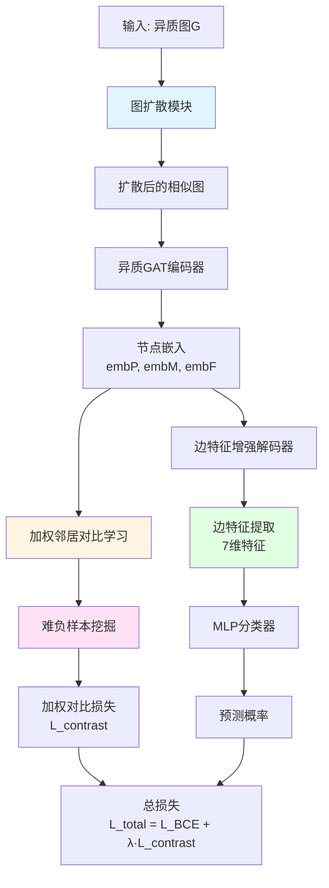
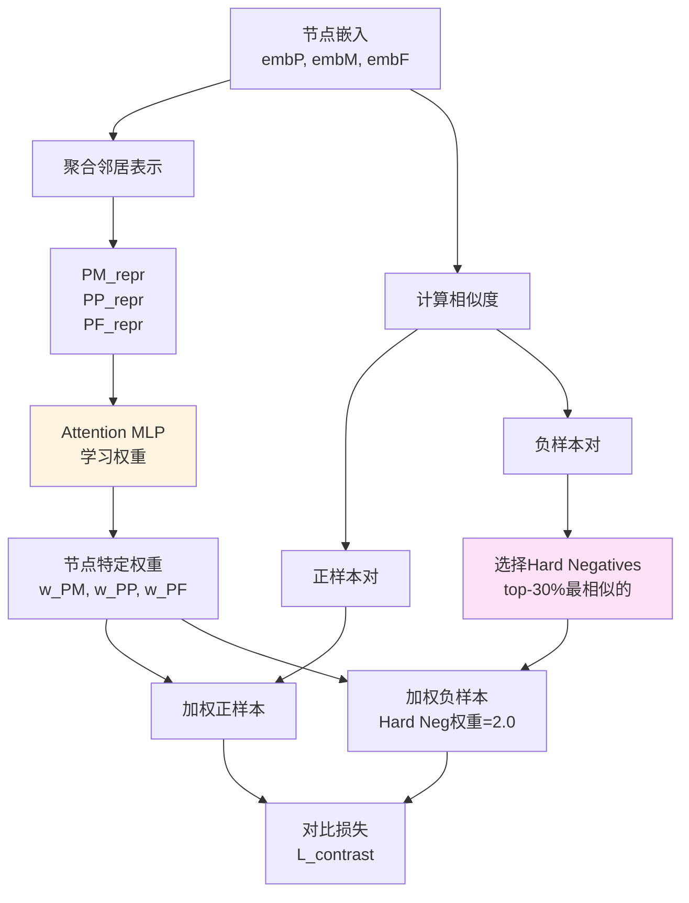
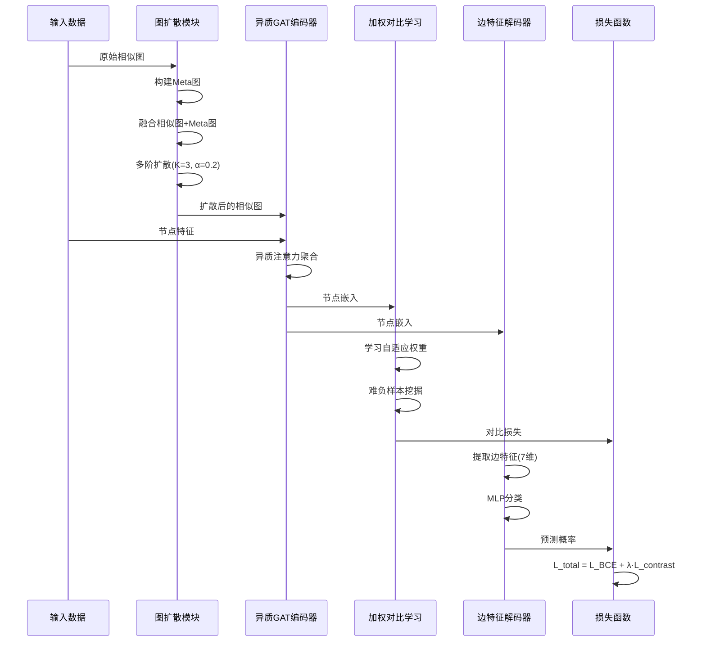
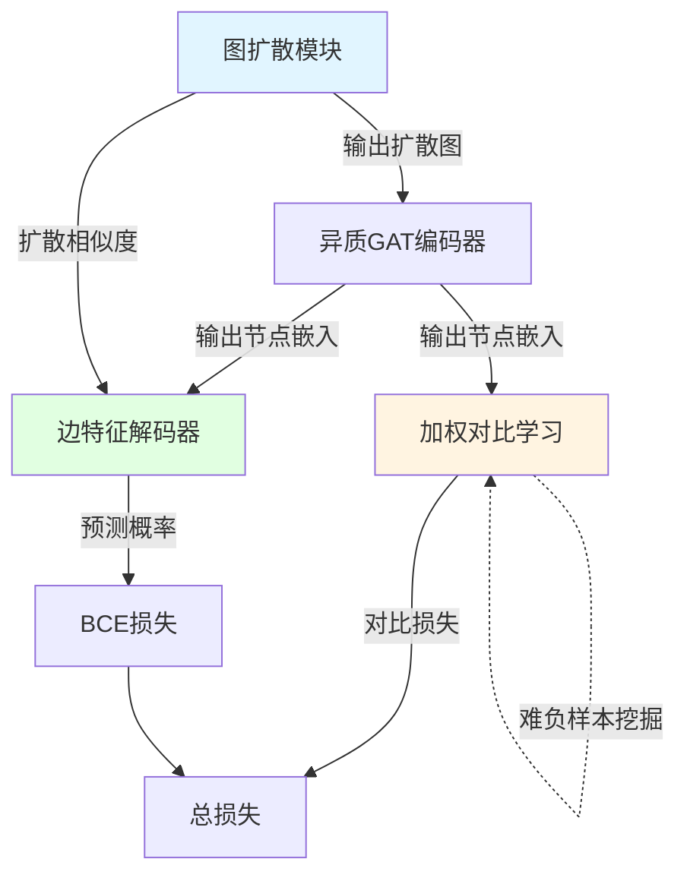
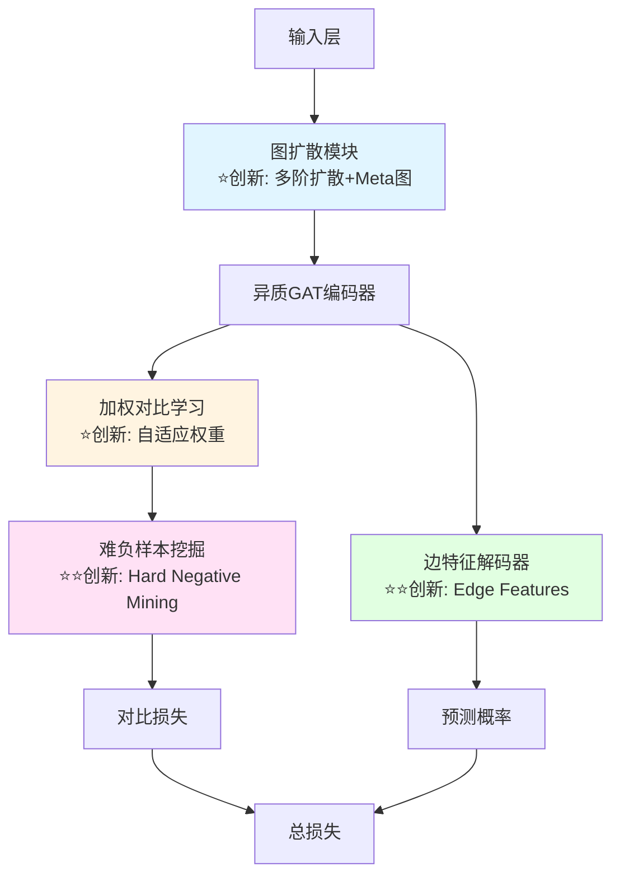

# 增强版HNCGAT模型结构图（Mermaid格式）

## 完整模型流程图



## 图扩散模块详细流程

```mermaid
graph LR
    A1[原始相似图<br/>A_sim, B_sim] --> B1[构建Meta图]
    B1 --> C1[A_meta = PM×PM^T + PF×PF^T<br/>B_meta = MP^T×MP + MF×MF^T]
    C1 --> D1[融合<br/>A_fused = A_sim + β·A_meta]
    D1 --> E1[归一化<br/>A_norm = D^{-1/2}·A·D^{-1/2}]
    E1 --> F1[多阶扩散<br/>S = I + α·A_norm + α²·A_norm² + α³·A_norm³]
    F1 --> G1[扩散相似图<br/>diff_A_sim, diff_B_sim]
    
    style B1 fill:#e1f5ff
    style F1 fill:#ffe1f5
```

## 加权对比学习流程



## 边特征增强流程

```mermaid
graph LR
    A3[节点对<br/>protein_i, metabolite_j] --> B3[提取边特征]
    B3 --> C3[1. common_GO]
    B3 --> D3[2. protein_degree]
    B3 --> E3[3. metabolite_degree]
    B3 --> F3[4. protein_avg_sim]
    B3 --> G3[5. metabolite_avg_sim]
    B3 --> H3[6. protein_diff_sim]
    B3 --> I3[7. metabolite_diff_sim]
    
    C3 --> J3[拼接<br/>7维特征]
    D3 --> J3
    E3 --> J3
    F3 --> J3
    G3 --> J3
    H3 --> J3
    I3 --> J3
    
    J3 --> K3[Node Embeddings<br/>embP[i], embM[j]]
    K3 --> L3[边表示<br/>128+7=135维]
    L3 --> M3[MLP分类器]
    M3 --> N3[预测概率]
    
    style B3 fill:#e1ffe1
    style J3 fill:#ffe1f5
```

## 完整数据流



## 模块依赖图



## 内存优化流程

```mermaid
graph TB
    A4[大batch<br/>200000个样本对] --> B4{是否>2000?}
    B4 -->|是| C4[分批处理<br/>每批2000个]
    B4 -->|否| D4[直接处理]
    
    C4 --> E4[Batch 1: [0:2000]]
    C4 --> F4[Batch 2: [2000:4000]]
    C4 --> G4[Batch N: [N-2000:N]]
    
    E4 --> H4[提取边特征]
    H4 --> I4[清理内存<br/>del + empty_cache]
    I4 --> J4[保存特征]
    
    F4 --> H4
    G4 --> H4
    
    J4 --> K4[拼接所有批次]
    D4 --> K4
    K4 --> L4[归一化特征]
    L4 --> M4[送入MLP]
    
    style C4 fill:#ffe1f5
    style I4 fill:#fff4e1
```

## 创新点位置图



